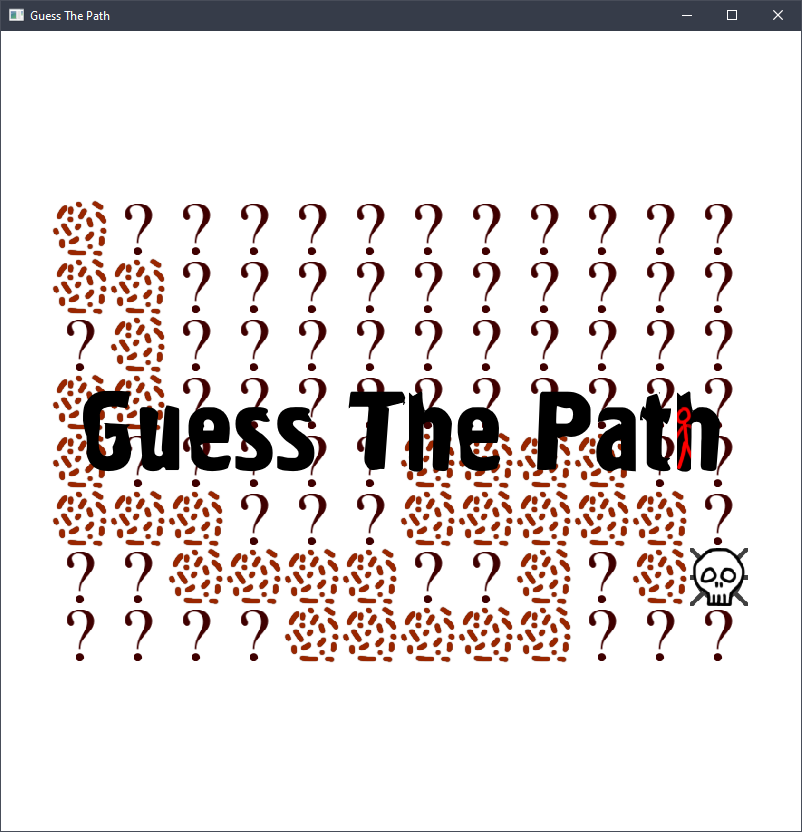
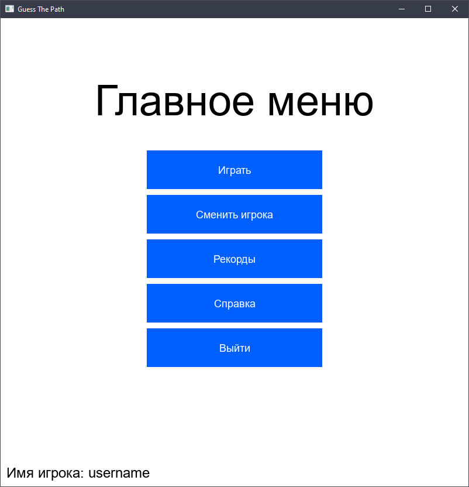
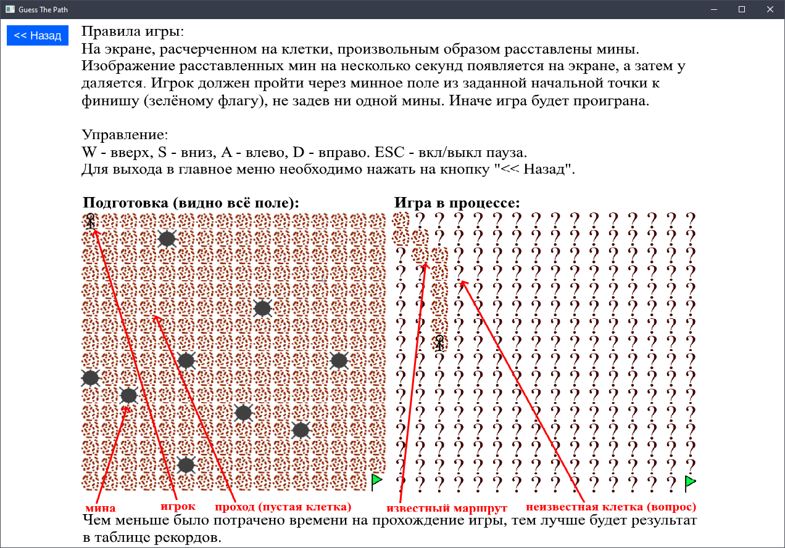
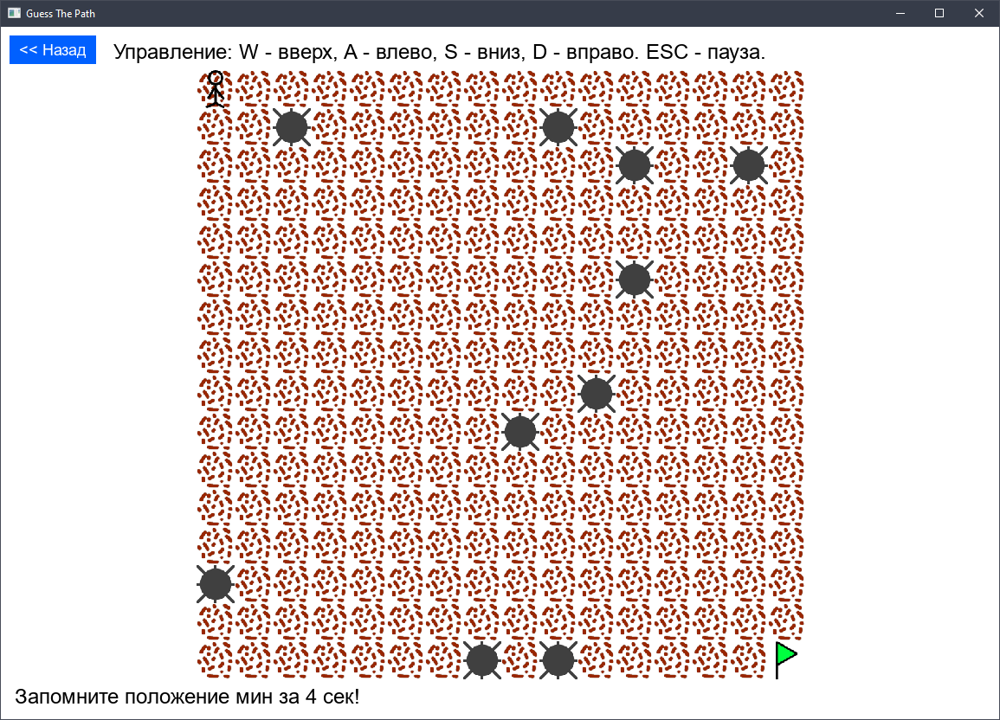
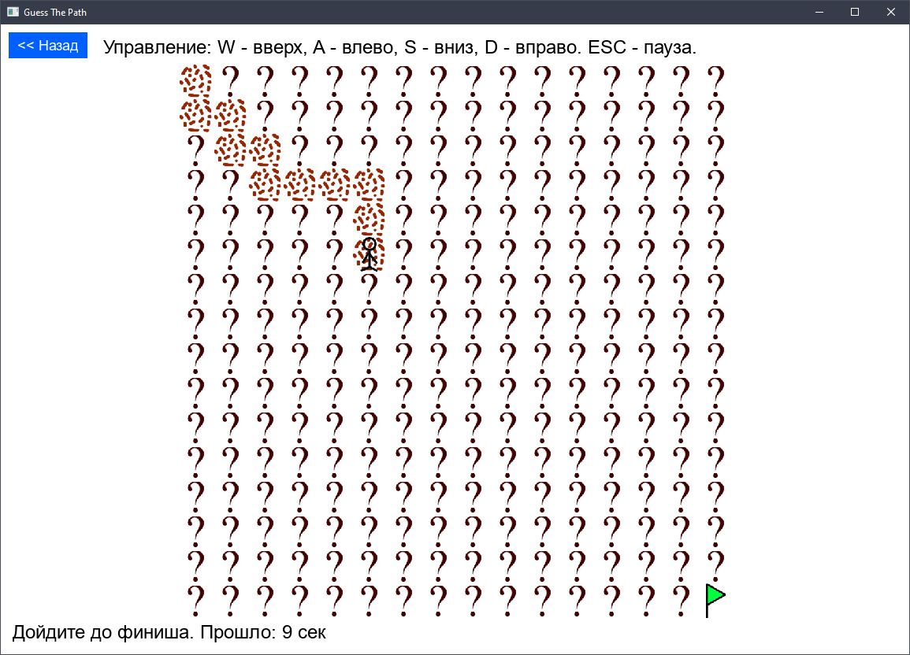
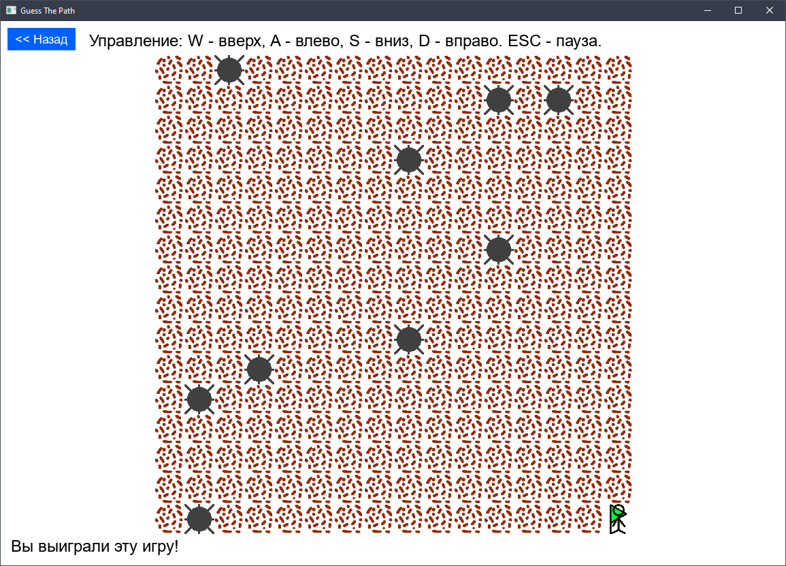
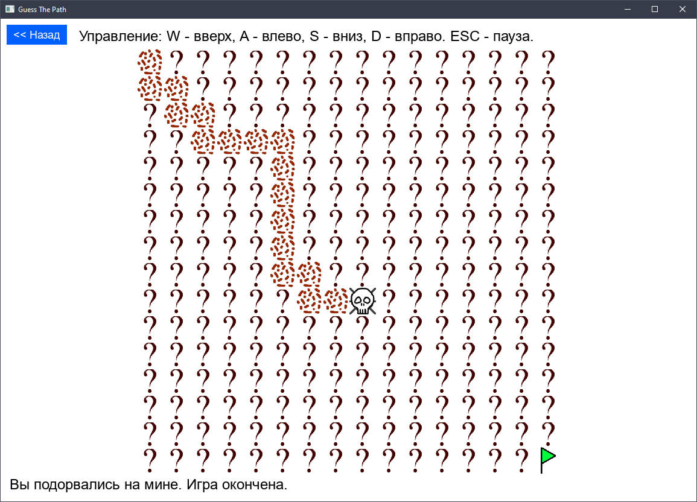
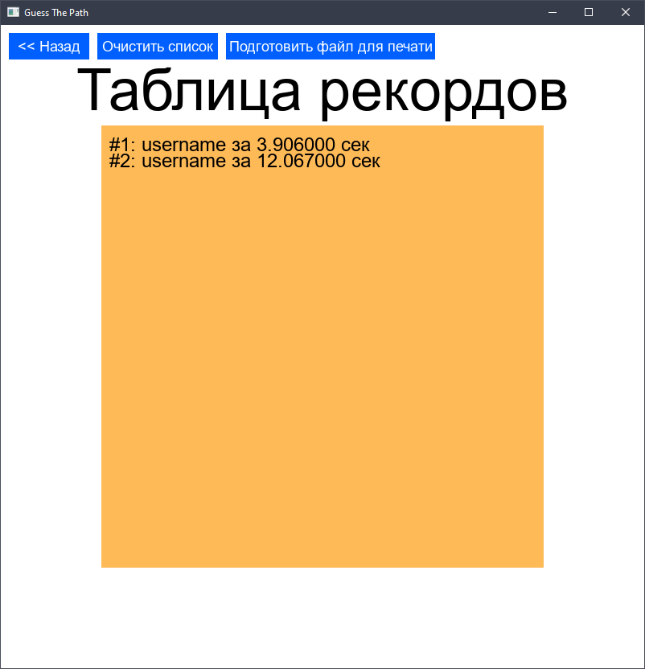

# GuessThePath

## Описание

Курсовая работа по дисциплине «Язык высокого уровня», первый курс бакалавриата (лето 2022 г.). 

**Стек технологий**: C++ (std 2011), SDL 2.

**Правила игры**. Игра моделирует поле с минами. На экране, расчерченном на клетки, произвольным образом расставлены ловушки. Изображение расставленных мин на несколько секунд появляется на экране, а затем удаляется. Игрок должен пройти через минное поле из заданной начальной точки в указанную конечную, не задев ни одной мины.

## TODO

- [ ] Подключение зависимостей: добавить исходный код напрямую или дополнить сборку библиотеками для разных платформ.

- [ ] Перенести основную логику игры с объекта экрана на объект карты.

## Скриншоты

## License

See LICENSE file for more information.
